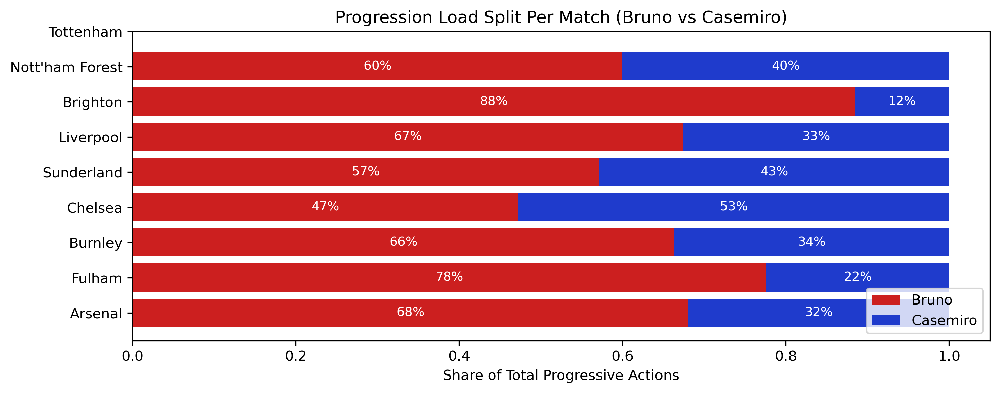
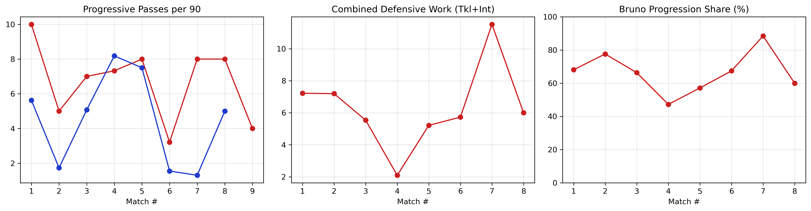
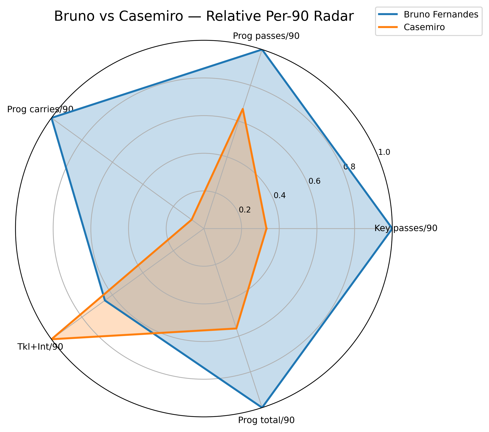
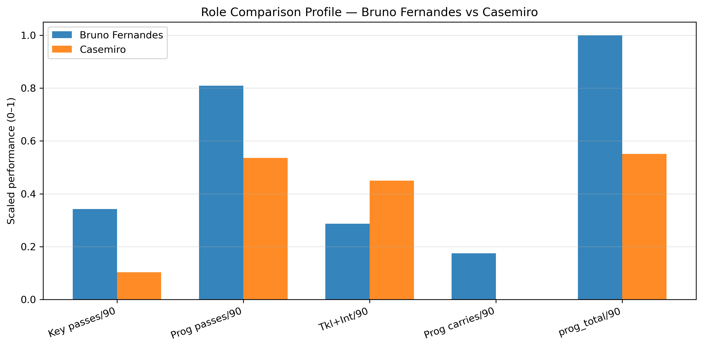

Manchester United Midfield Dynamics
Bruno Fernandes & Casemiro Analysis (2025–26 Season Data)
Executive Summary

This project analyzes matches where Bruno Fernandes and Casemiro both started in midfield during Manchester United’s 2025–26 campaign. Using match-level and player-level data from FBref, we evaluate each player’s contribution across progression, creativity, defensive stability, and involvement in possession.

The goal is to understand how their profiles complement one another within United’s tactical system, while demonstrating a modern football-analytics workflow suitable for professional clubs.

1. Why This Analysis Matters

Midfield structure underpins a team’s ability to control matches through:

progression into advanced zones

defending transitions

sustaining possession

creating high-quality chances

This project focuses on how Fernandes and Casemiro function together as a midfield pairing and what it reveals about squad balance and tactical design.

2. Data Sources

Raw data scraped from FBref match logs and statistical tables

Only matches where both players started together were included

All metrics standardized to per 90 minutes for comparability

Processed datasets are stored in the data/ directory.

3. Repository Structure
Top-Level Folders

data/ – Raw and cleaned tables

notebooks/ – Jupyter notebooks in chronological workflow order

visuals/ – Exported PNGs for dashboards and plots

README.md – Main documentation

Notebook Workflow

01_clean_data.ipynb – Combining raw tables

02_feature_engineering.ipynb – Creating per-90 features

03_visualizations.ipynb – Progression & impact metrics

04_radar_plots.ipynb – Radar profiles

05_extra_visuals.ipynb – Supplemental visuals

4. Key Metrics Included
Progression & Creativity

Progressive passes per 90

Progressive carries per 90

Key passes per 90

Shot creation actions

Expected assists

Defensive Output

Tackles + interceptions per 90

Duel involvement

Recoveries

Pressures (future addition)

Possession Profile

Touches in build-up and advanced zones

Carry distances

Total possession involvement

## 5. Visualizations

Below are the main visuals included in this analysis.

### Progression Split  

### Creativity vs Defensive Impact  

### Match Dashboard  

### Radar Profiles  

Bruno Fernandes  

Casemiro  

Overlay Comparison  

### Role Comparison Profile  

Casemiro

Overlay Comparison

Role Comparison Profile

6. Key Insights
Bruno Fernandes

Leads the midfield in progressive passes, shot creation, and final-third involvement.

Provides the majority of United’s creative progression when paired with Casemiro.

Operates significantly higher up the pitch, evidenced by final-third touches and carries.

Casemiro

Dominates defensive actions per 90 (tackles + interceptions).

Offers more stability in early build-up and defensive transitions.

Provides essential cover that enables Bruno’s advanced positioning.

Combined Midfield Profile

The pairing forms a classic creator + stabilizer relationship.

United rely heavily on Bruno for ball progression into dangerous zones.

Casemiro’s defensive output allows United to maintain structural balance, especially in transitions.

Role comparison profile confirms clear complementarity rather than redundancy.

7. Additional Visuals

The 05_extra_visuals.ipynb notebook includes:

Average Per-90 Comparison Bar Chart

Scaled Role Comparison Profile (0–1)

These supplemental visuals highlight category-specific strengths in a format commonly used in club scouting reports.

8. Future Work

Extend analysis to full 2025–26 and 2026–27 seasons

Add pressure metrics (PPDA, pressure regains, pressing zones)

Implement possession value models (xThreat, VAEP)

Construct dynamic passing networks

Add match-state segmentation and contextual opponent adjustments

Build recruitment-style comparison radars vs league midfielders

9. License

This project is released under the MIT License.

Contact

Arnav Jain
Master of Science in Data Science, University of Virginia
LinkedIn: https://www.linkedin.com/in/arnavjain2026/

For collaboration or football-analytics opportunities, feel free to reach out.
