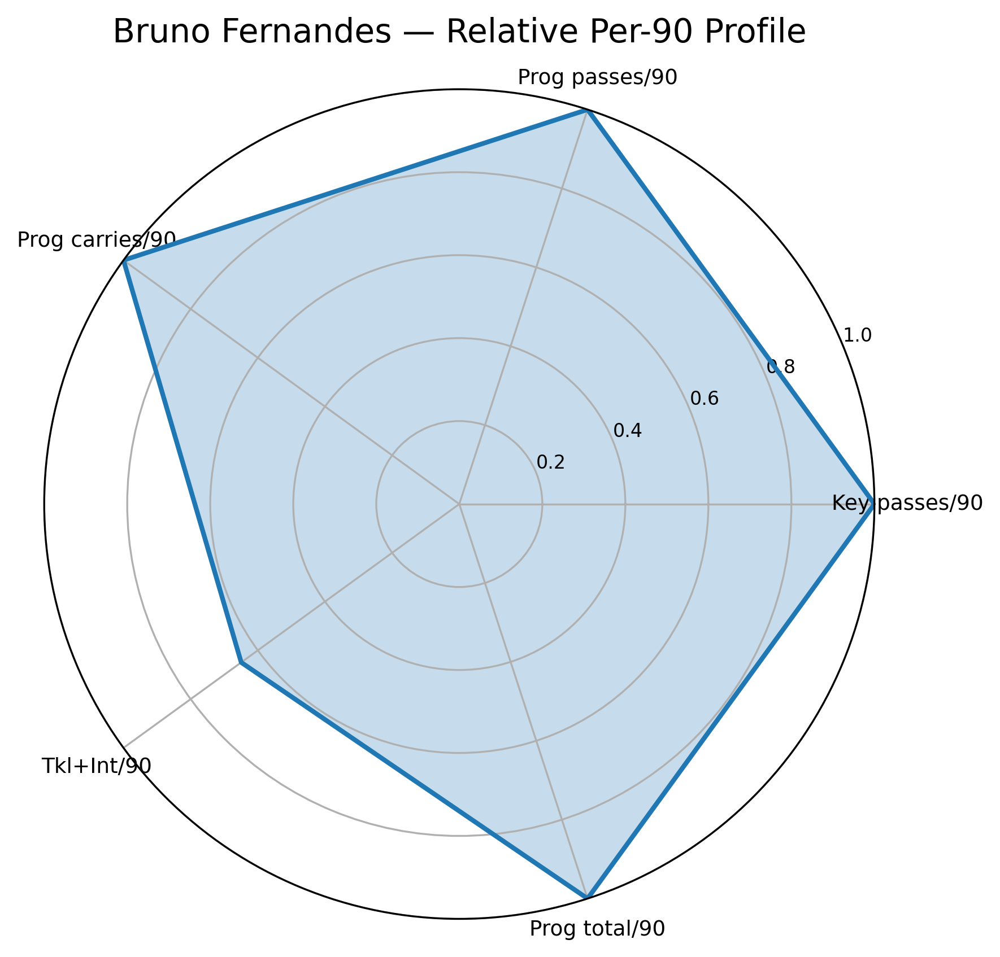
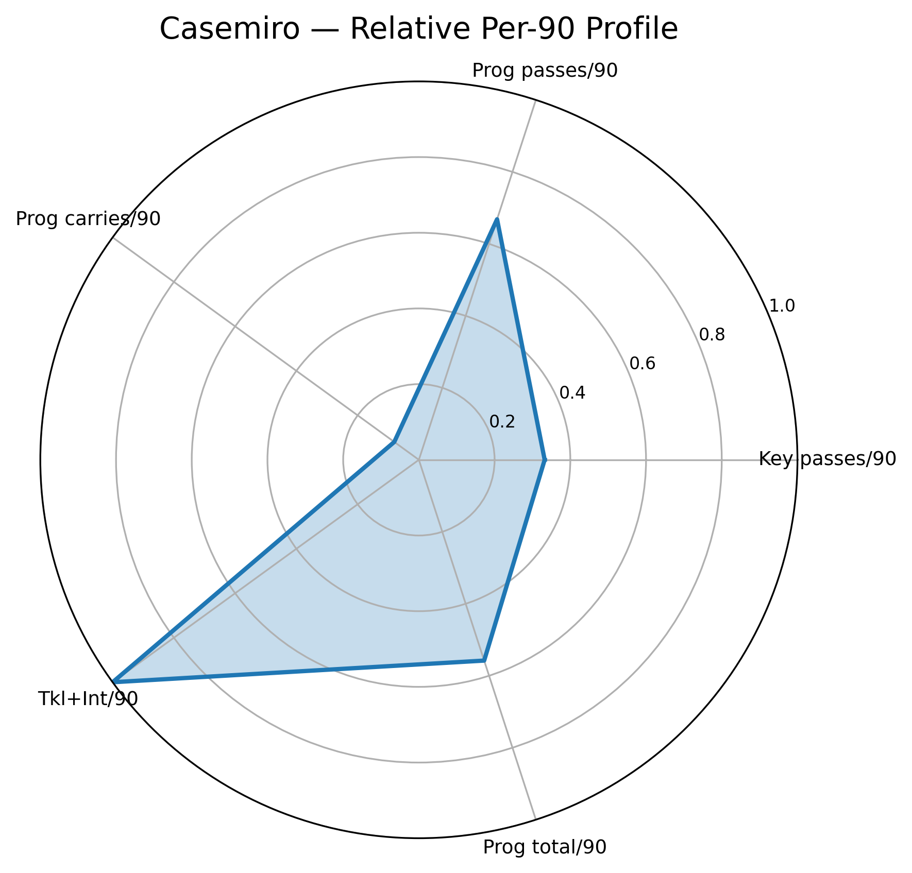

Manchester United Midfield Dynamics: Bruno Fernandes & Casemiro Analysis (2025–26 Season Data)
Executive Summary

This project evaluates the on-pitch relationship between Bruno Fernandes and Casemiro during matches where both started for Manchester United in the 2025–26 campaign. Using detailed match-level data from FBref, we analyze their per-90 performance profiles across creativity, progression, defensive impact, and chance involvement.
The goal is to understand how their roles complement (or conflict) within Manchester United’s evolving tactical structure and to demonstrate a modern football analytics workflow suitable for professional club environments.

1. Why This Analysis Matters

Understanding midfield dynamics is central to squad building and match preparation. A team’s ability to progress the ball, resist pressure, and protect structure depends heavily on how midfield roles complement each other. This analysis helps answer key questions:

How much progression does Bruno provide relative to Casemiro?

Does Casemiro’s defensive workload enable Bruno’s creative freedom?

How stable is their impact across different opponents and match states?

What does their combined statistical profile tell us about United’s midfield balance?

This type of work mirrors the analysis done inside professional clubs and recruitment departments.

2. Project Overview

We consolidate multiple FBref match-level tables for both players:

Passing

Pass types

Possession

Defensive actions

Miscellaneous stats

Goals & shots

These tables are cleaned, merged, and transformed into a unified dataset.
Feature engineering produces per-90 metrics and combined performance statistics that enable fair comparison and visualization.

Outputs include:

Match-to-match progression trends

Creativity and defensive impact maps

Individual radar charts

An overlay radar comparing both players

Exported PDF reports

This project serves as a portfolio-ready football analytics case study.

3. Key Visuals

Below are the main visuals generated by the analysis (ensure these filenames match your actual outputs).

## Progression Metrics (per 90)

Creativity vs Defensive Impact Map

Bruno Fernandes Radar

Casemiro Radar

Overlay Radar (Comparison)

4. Tactical Insights
Bruno Fernandes

Primary driver of final-third progression, key passes, and shot-creating actions

High involvement in xGChain and possession value sequences

Provides verticality through progressive passes and carries

Casemiro

Leads the team in defensive actions per 90, especially tackles + interceptions

Offers transition stability and central defensive presence

Supports buildup via safer progression patterns

Lower creative involvement but high value in regains and structure

Combined Understanding

Bruno provides United’s creative ceiling; Casemiro forms the defensive floor

Their balance defines the team’s ability to sustain pressure and advance play

The overlay radar highlights complementary strengths rather than overlap

Match-to-match variance reflects tactical game state and opponent quality

5. Data Pipeline

The project is structured into four notebooks, each responsible for a specific step in the workflow.

01_clean_data.ipynb

Loads raw FBref exports

Cleans and standardizes columns

Fixes match metadata

Produces: midfield_matches_clean.csv

02_feature_engineering.ipynb

Creates per-90 metrics

Builds combined statistics (progression, defensive work, creation)

Produces:

midfield_matches_features.csv

player_summary_per90.csv

03_visualizations.ipynb

Match-level progression trend plots

Creativity vs defensive impact scatter

Mini-dashboard of key metrics

Produces:

PNG visualizations

03_visualizations.pdf

04_radar_plots.ipynb

Bruno + Casemiro radars

Overlay radar comparison

Produces:

radar_bruno.png

radar_casemiro.png

radar_overlay.png

04_radar_plots.pdf

6. Installation and Usage
Install dependencies
pip install -r requirements.txt

Run Notebooks

Execute notebooks in numerical order:

01_clean_data.ipynb
02_feature_engineering.ipynb
03_visualizations.ipynb
04_radar_plots.ipynb

7. Folder Structure (Clean Version)
project_root/
    data/
        raw_fbref_exports/
        midfield_matches_clean.csv
        midfield_matches_features.csv
        player_summary_per90.csv

    visuals/
        progression_plot.png
        impact_plot.png
        radar_bruno.png
        radar_casemiro.png
        radar_overlay.png

    notebooks/
        01_clean_data.ipynb
        02_feature_engineering.ipynb
        03_visualizations.ipynb
        04_radar_plots.ipynb

    reports/
        03_visualizations.pdf
        04_radar_plots.pdf

    README.md
    requirements.txt

8. Future Work

Expand dataset to full 2025–26 and 2026–27 seasons

Add pressure metrics (PPDA, pressure regains, pressing zones)

Implement possession value model (xThreat or VAEP)

Add touch maps and dynamic passing networks

Build a match-level prediction model (expected progression contribution)

Create a recruitment-style comparison vs league midfielders

9. Purpose

This project is designed as a professional football analytics case study demonstrating:

Data cleaning and integration from public sources

Feature engineering on football datasets

Effective statistical storytelling

Visualization and radar profiling

Tactical interpretation grounded in real match contexts

It forms the foundation of a future portfolio aimed at roles in football data science, recruitment analysis, or performance analysis.
